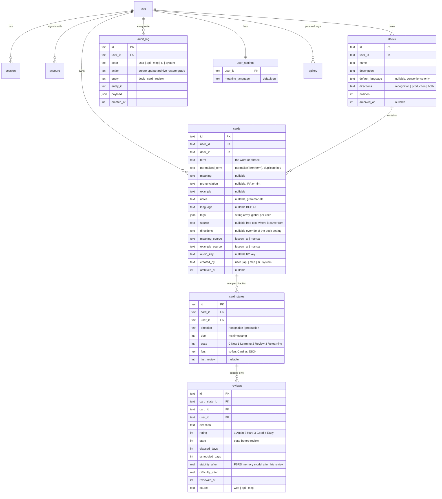

# Data model and API

Reference for what is in D1 and what the API returns. Source of truth is `packages/core/src/schema` for tables, `packages/core/src/types.ts` for request bodies and `packages/core/src/responses.ts` for responses. This page describes; it does not decide.

## Entities

All tables carry `created_at` and `updated_at` as millisecond integers. Ids are 19-character strings, time-prefixed so they sort by creation. Rows are never deleted by the app: decks and cards archive, reviews and audit rows are permanent.

The `user`, `session`, `account`, `verification` and `apikey` tables belong to Better Auth and are generated, not hand-written. Every app table has `user_id` so a second user is a policy change, not a migration.

### Why the scheduling state is JSON

`card_states.fsrs` holds the full ts-fsrs Card object (stability, difficulty, reps, lapses, learning step, due, last review). `due` and `state` are copied out into real columns so the queue can be queried without parsing JSON. If ts-fsrs adds a field, nothing needs a migration.

### Directions

`decks.directions` says how cards in the deck are asked: `recognition` (see the term, recall the meaning), `production` (see the meaning, produce the term) or `both`. A card may override with its own `directions`. Each concrete direction gets its own `card_states` row with its own schedule, because recognising and producing are different skills. When a deck switches to `both`, the missing state rows are created due now.

### Tags and source

Tags are labels on a card, global to the user, any number per card, stored as a JSON array until search or renaming needs a table. `source` is free text saying where the card came from. When AI capture arrives, pasted material becomes a `sources` row and cards point at it with `source_id`; the text column stays for hand-added cards.

### Why language is on the card

Decks can mix languages or hold non-vocabulary cards. `cards.language` is nullable. A null language means no audio and no language-specific AI for that card, and everything else works. `decks.default_language` only prefills new cards.

## API

The API is documented by the running app: [`/api/docs`](https://lymi.k-porshnieva.workers.dev/api/docs) is a reference UI, [`/api/openapi.json`](https://lymi.k-porshnieva.workers.dev/api/openapi.json) is the OpenAPI 3.1 document. Both are generated from the route descriptions in `apps/web/src/server/routes` and the Zod schemas in `packages/core/src/types.ts` (request bodies) and `packages/core/src/responses.ts` (responses), so they cannot drift from the code. This page keeps only what the document does not say.

Three ways in, one shape on the server. A session cookie is the learner in the app, actor `user`, scope `write`. An `x-api-key` header is a personal key, actor `api`, with the key's scope. An OAuth bearer token is an MCP client, actor `mcp`. `apps/web/src/server/principal.ts` resolves all three into `{ user, actor, scope }`.

### Rules the API enforces

- Reads need any credential. Writes need the `write` scope, or 403.
- Grading and key management are the learner's alone. Any key or token gets 403, whatever its scope.
- A duplicate (same normalised term and language as an active card anywhere in the learner's decks) is skipped and reported with the existing card, never rejected. Adds return one outcome per card sent. ADR 0004.
- A grade older than the state's last review is ignored and reported as `duplicate`. This is what makes offline replay safe.
- Every write appends to `audit_log` with its actor, and every card carries `created_by`, so Activity can show what integrations and the AI wrote.
- Archive instead of delete, always.
- `language` on a new card defaults to the deck's `default_language` when not given.
- Validation failures return `400 { error, issues }` with the Zod issues. Missing or bad credentials return `401 { error }`.

## Not decided yet

- One `meaning` string per card, or multiple senses as rows. Decide before the first deploy with real data.
- Holding back the second direction of a card until the next day, so seeing the term is not a giveaway for producing it later in the same session. Queue logic, not schema.
- Tags as a JSON column (current) or a table, once search needs them.
