# Data model and API

Reference for what is in D1 and what the API returns. Source of truth is `packages/core/src/schema` for tables, `packages/core/src/types.ts` for request bodies and `packages/core/src/responses.ts` for responses. This page describes; it does not decide.

## Entities

```mermaid
erDiagram
  user ||--o{ session : has
  user ||--o{ account : "signs in with"
  user ||--o{ decks : owns
  user ||--o{ series : owns
  series ||--o{ decks : "orders, optionally"
  user ||--o{ cards : owns
  decks ||--o{ cards : contains
  decks ||--o{ sections : "orders, optionally"
  sections ||--o{ cards : "groups, optionally"
  sections ||--o{ section_starts : "opened by each learner"
  decks ||--o{ deck_members : "shared with"
  decks ||--o{ deck_invitations : "join link"
  decks ||--o| deck_publications : "published as"
  user ||--o{ deck_members : "studies"
  cards ||--o{ card_states : "one per learner per review mode"
  cards ||--o{ card_images : "one active picture"
  card_states ||--o{ reviews : "append-only"
  user ||--o{ review_days : "one per local date"
  review_days ||--o{ reviews : "counts toward"
  reviews ||--o| review_undos : "taken back"
  user ||--o{ audit_log : "every write"
  user ||--|| user_settings : has
  user ||--o| user_avatars : "photo"
  user ||--o{ imports : "brings in"
  user ||--o{ exports : "takes out"
  user ||--o{ feedback : "writes to Lymi"
  imports ||--o{ cards : "added"
  imports ||--o{ decks : "made"
  user ||--o{ apikey : "personal keys"
  user ||--o{ push_subscriptions : "one per subscribed device"

  series {
    text id PK
    text user_id FK
    text name
    int position "order among the owner's series"
    int archived_at "nullable"
  }
  decks {
    text id PK
    text user_id FK
    text series_id FK "nullable, the owner's series"
    text name
    text description
    text default_language "nullable, convenience only"
    text directions "recognition | production | both"
    int position "order within its series, or within Library"
    text section_progression "automatic | manual | open, default automatic"
    int archived_at "nullable"
    text import_id "nullable, the import that made it"
    text external_id "nullable, the source's key"
  }
  sections {
    text id PK
    text deck_id FK
    text name
    int position "order within the deck"
    int archived_at "nullable; cards archived with it share it"
  }
  section_starts {
    text id PK
    text section_id FK
    text user_id FK
    text how "ready | early | auto"
    int started_at
  }
  cards {
    text id PK
    text user_id FK
    text deck_id FK
    text term "the word or phrase"
    text normalized_term "normaliseTerm(term), duplicate key"
    text meaning "nullable"
    text pronunciation "nullable, IPA or hint"
    text example "nullable"
    text notes "nullable, grammar etc"
    text language "nullable BCP 47"
    json tags "string array, global per user"
    text source "nullable free text: where it came from"
    text directions "nullable override of the deck setting"
    text meaning_source "lesson | ai | manual"
    text example_source "lesson | ai | manual"
    text pronunciation_source "lesson | ai | manual"
    text enrichment_status "nullable working | failed"
    text audio_key "nullable R2 key"
    json review_modes "nullable mode keys, read only while directions is set"
    text image_version "nullable opaque token of the last picture write"
    text section_id FK "nullable, a section of its own deck"
    text created_by "user | api | mcp | ai | system"
    int archived_at "nullable"
    text import_id "nullable, the import that added it"
    text external_id "nullable, the source's id"
  }
  exports {
    text id PK
    text user_id FK
    text format "lymi | anki"
    text deck_id "nullable; null is the whole library"
    text file_name "private, never logged"
    text status "exporting | done | failed | expired"
    text failure "nullable too_large | internal"
    text object_key "nullable R2 prefix of the segments"
    int segments "segments that make up the file"
    int byte_size "nullable until done"
    json counts "decks, cards, reviews, pictures, sounds"
    int expires_at "nullable, when the file is deleted"
  }
  imports {
    text id PK
    text user_id FK
    text source "anki | mochi"
    text file_name "private, never logged"
    int byte_size
    text status "uploading | inspecting | ready | importing | done | failed | cancelled"
    text failure "nullable code"
    text object_key "nullable R2 key, cleared files"
    json summary "decks, note types, counts"
    json choices "language per deck, role per field"
    json counts "what was written"
    int written "chunks written"
    int archived_at "nullable, stamped on the cards it archived"
  }
  user_settings {
    text user_id PK
    text app_language "nullable en | uk | ru"
    text meaning_language "default en"
    int daily_goal "recall attempts, default 50"
    int daily_goal_chosen_at "nullable until chosen"
    text review_timezone "nullable IANA zone"
    text review_timezone_mode "automatic | manual"
    int review_timezone_updated_at "nullable"
  }
  user_avatars {
    text user_id PK
    text custom_key "nullable opaque R2 key"
    text custom_version "nullable delivery token"
    int custom_revision "bumped by every learner write"
    text google_key "nullable opaque R2 key"
    text google_version "nullable delivery token"
    int google_fetched_at "nullable, when that fetch began"
  }
  deck_members {
    text id PK
    text deck_id FK
    text user_id FK
    text role "owner | editor | contributor | learner"
    text invitation_id "nullable"
    int joined_at
    int removed_at "nullable, never deleted"
    text removed_by "nullable: owner | self"
  }
  deck_invitations {
    text id PK
    text deck_id FK
    text kind "link"
    text token "unique, 32 base64url chars"
    int revoked_at "nullable, permanent"
  }
  deck_publications {
    text id PK
    text deck_id FK "unique"
    text slug "unique, lower-case words and hyphens"
    text status "published | withdrawn"
    text summary
    text level "nullable, CEFR"
    text meaning_language
    text publisher
    text sources "JSON [{title, url?}]"
    int reviewed_at "nullable"
    int revision "raised on every publish or withdrawal"
    int published_at
    int withdrawn_at "nullable"
  }
  card_states {
    text id PK
    text card_id FK
    text user_id FK
    text direction "recognition | production | picture mode key"
    text mode "mode key; null only on rows an older Worker wrote"
    int due "ms timestamp"
    int state "0 New 1 Learning 2 Review 3 Relearning"
    text fsrs "ts-fsrs Card as JSON"
    int last_review "nullable"
  }
  reviews {
    text id PK
    text card_state_id FK
    text card_id FK
    text user_id FK
    text direction
    text mode "mode key; null only on rows an older Worker wrote"
    int rating "1 Again 2 Hard 3 Good 4 Easy"
    int state "state before review"
    int elapsed_days
    int scheduled_days
    real stability_after "FSRS memory model after this review"
    real difficulty_after
    int reviewed_at
    text source "web | api | mcp | import"
    text review_day_id FK "nullable: null before daily goals"
    text state_before "nullable JSON card state this grade replaced, for Undo"
  }
  card_images {
    text id PK
    text card_id FK
    text user_id FK "the card's owner"
    text object_key "private R2 key, never returned"
    text content_type "image/webp"
    int width
    int height
    int byte_size
    text description "nullable; picture modes wait for one"
    text source_kind "upload | url"
    text source_host "nullable, host of an imported link"
    text status "active | archived | replaced, one active per card"
    text created_by "user | api | mcp | ai | system"
  }
  review_days {
    text id PK
    text user_id FK
    text date "local YYYY-MM-DD, unique per user"
    int goal "snapshot; follows goal changes while open"
    text timezone "IANA zone the date was taken in"
    int zero_due_confirmed_at "nullable"
    text outcome "open | goal_met | exhausted | nothing_due"
  }
  review_undos {
    text review_id PK
    text user_id FK
    int undone_at
  }
  audit_log {
    text id PK
    text user_id FK
    text actor "user | api | mcp | ai | system"
    text actor_client "OAuth client or API key id"
    text actor_client_name "its name at the write"
    text action "create update archive restore grade"
    text entity "deck | series | section | card | review | account | import | export"
    text entity_id
    json payload
    int created_at
  }
  push_subscriptions {
    text id PK
    text user_id FK
    text endpoint "globally unique browser capability"
    text p256dh "browser public key"
    text auth "browser auth secret"
    int expiration_time "nullable"
    text reminder_time "local HH:MM, quarter-hour"
    text timezone "IANA time zone"
    text last_sent_local_date "nullable YYYY-MM-DD"
  }
```

All tables carry `created_at` and `updated_at` as millisecond integers. Ids are 19-character strings, time-prefixed so they sort by creation. Learning content is never deleted by the app: decks and cards archive, while reviews and audit rows are permanent. Push subscriptions are device capabilities, not learning content, and are deleted when the learner turns reminders off or the push service reports that the subscription has expired.

The `user`, `session`, `account`, `verification` and `apikey` tables belong to Better Auth and are generated, not hand-written. Every app table has `user_id` so a second user is a policy change, not a migration.

### Review days

A review day is one learner-local date measured against its streak goal. Attempts are counted from `reviews` less `review_undos`, never stored as a counter. A grade fixes `review_day_id` when it lands, in the review timezone of that moment, so a later timezone change never moves completed history. `outcome` only moves forward on a grade or a lower goal; Undo recomputes it and can reopen a day. Reviews from before daily goals have no day and still count as a reviewed day. The rules are in [the daily review goal proposal](proposals/daily-review-goal-and-rolling-queue.md) and live in `services/review-days.ts`.

### Sections

A section is an optional, ordered part of one deck, and every learner of the deck sees it. `cards.section_id` points at a section of the card's own deck; moving a card to another deck clears it. Archiving a section with `cards: keep` leaves `section_id` on its cards, and a card in an archived section reads as having none, so Restore regroups it. Archiving with `cards: archive` stamps the cards with the section's own `archived_at`.

Unless `decks.section_progression` is `open`, each learner opens sections in order, and the rules live in `packages/core/src/sections.ts`. Open sections are always a prefix of the deck: every section up to the last one the learner has a `section_starts` row for, or has started a card in, plus the first section with cards. The next section is ready once every card of the current one has left New and 80% of them, rounded up, are Known by the state the deck's list shows. Start writes a row for the target and every section before it that was not open, with `on conflict do nothing`, so a retry or a second device lands the same, and rows are never removed. In an `automatic` deck, `gradeCard` writes that row itself, `how = 'auto'`, on the grade that makes the next section ready and on its retries; readiness is only a grade away, so nothing else has to look. Writing it once is what keeps a section open after the learner later forgets cards below 80%. The draw in `services/draw.ts` leaves out a card in a section that is not open unless the learner has already started it, so Today, deck and series review, rounds, reminders and the offline draw all agree.

### Shared decks

A deck's owner is `decks.user_id`. Everyone else who studies it has a `deck_members` row. Leaving or being removed sets `removed_at` and keeps the row; `removed_by = 'owner'` blocks the join link until a named invitation. `card_states` is unique per `(card_id, user_id, direction)`, so each learner of a shared card has their own schedule. Every read goes through `memberOf` in `services/members.ts`; every write to a deck's content requires the owner. [ADR 0011](adr/0011-a-shared-deck-is-one-deck-with-many-learners.md).

A deck has at most one unrevoked `deck_invitations` link, enforced by a partial unique index. Turning the link off sets `revoked_at` for good, and turning it on again inserts a new row with a new token. The token is a capability: it appears in the join URL and nowhere else, never in audit payloads, logs or error messages. `/join/<token>` is rendered by the product Worker; it shows up to three recent cards, and its title and Open Graph tags carry none. A signed-out visitor's link rides through sign-in in a ten-minute HttpOnly cookie, which lets `user.create.before` admit an account that is not on `ALLOWED_EMAILS`, and `session.create.after` completes the membership. Repeated joins make one membership and one audit row.

A deck has at most one `deck_publications` row. Publishing inserts or updates it and raises `revision`; withdrawing sets `status` and `withdrawn_at` and keeps the row, so publishing again brings the same slug back. Only an owner on `PUBLISHER_EMAILS` publishes. `/add/<slug>` admits sign-up the way a join link does: the slug rides in the same cookie with a `p.` prefix, and the membership write re-checks that the deck is still published and not archived. The join audit row records `via: publication`. ADR 0020. The public site reads a publication only through `loadPublicDeck` in `packages/core/src/catalog.ts`: the publication's page fields, the deck's name and language, and the term and meaning of each active card under its active section. ADR 0016.

### Series

A series belongs to `series.user_id` and holds only that owner's decks through `decks.series_id`; a deck is in at most one. Every deck read returns `seriesId` from `effectiveSeriesId` in `services/series-access.ts`, which is null for a member and while the series is archived, so a member never learns a series exists. `decks.position` orders a deck within its active series and joins it last; every other deck sorts as 0 and so by creation date, which keeps a Library without series exactly as it was and returns a deck that leaves a series to its old place. Order writes send the whole list (`PUT /api/series/{id}/decks`, `PUT /api/series/order`) as one JSON parameter to a single statement, so a retry lands the same order and D1's 100-parameter cap never splits the write.

Archiving a series keeps `decks.series_id` and `decks.position`, so Restore regroups the decks in their order; clearing `seriesId` on a deck meanwhile keeps it out. With `decks: archive` the series' active decks take the series' own `archived_at`, and Restore returns exactly the decks whose `archived_at` still equals it; a deck archived earlier on its own stays archived. Reviewing a series is the ordinary draw over the rows of its active decks (ADR 0019).

### Avatars

The learner's upload and the Google fallback sit in separate columns, and the upload wins while it exists. Both are 320 px WebP objects in the private `PRIVATE_IMAGES` bucket, re-encoded by the Images binding so no metadata survives, under random keys that name neither the learner nor the source. `/api/avatar/<version>` serves only the active version, with `private, no-store`; the client holds the bytes in memory through TanStack Query, so sign-out clears them. An upload or removal sends `If-Match` with `custom_revision` and gets 409 if the photo changed since. Each Google sign-in refreshes the fallback from the ID token's `picture`, fetched only from `*.googleusercontent.com`; a refresh that started earlier than the stored one is dropped, and a failed one keeps the previous photo and never blocks sign-in.

### Why the scheduling state is JSON

`card_states.fsrs` holds the full ts-fsrs Card object (stability, difficulty, reps, lapses, learning step, due, last review). `due` and `state` are copied out into real columns so the day's candidates can be selected without parsing JSON. If ts-fsrs adds a field, nothing needs a migration.

The scheduler has one 10-minute learning and relearning step. A row written under the earlier two-step ladder is clamped to the single step when it is read, so a miss on it stays in learning rather than graduating.

### The review draw

Nothing about a review is stored. `services/draw.ts` loads every asked state due before the learner-local day ends or reviewed today, with its sibling direction, plus today's non-undone reviews in every scope, and hands them to `draw` in `packages/core`. The queue, each deck's count, day exhaustion and the reminder count are that one function over the same rows, so they cannot disagree. The rules are in [ADR 0019](adr/0019-the-review-queue-is-a-deterministic-weighted-draw.md).

### Review modes

A review mode is a cue and a target: `term_to_meaning` (recognition), `meaning_to_term` (production), `image_to_term` or `image_to_meaning`. Picture modes are set on cards only; a deck refuses them. The API sends a list of `{ cue, target }` as `reviewModes` on decks and cards, and a card's list overrides its deck's. Each mode a card is asked in gets its own `card_states` row with its own schedule, because recognising and producing are different skills. Turning a mode on creates the missing rows due now; turning one off leaves them uncounted (ADR 0007). A picture mode is asked only while the card has an active picture with a description. A card whose list holds only picture modes stores the text mode with the same target in `directions` and is asked in it until it has such a picture; that fallback is never asked beside the picture mode. ADR 0014 is the decision. A card asked in several modes starts them one at a time, meaning → term first, and only one of its modes is reviewed on any day (ADR 0019).

The move from directions is expand and contract, and it is in the expand phase. `decks.directions` stores a deck's list, since a text-mode list maps one-to-one onto it, and `cards.directions` stores a card's text modes. `cards.review_modes` adds a card's order and picture modes, and `effectiveModes` in `packages/core/src/modes.ts` heals a list an older Worker left stale by writing only `directions`. A legacy `directions` write replaces a card's text modes and keeps its picture modes. `directions` stays in the API as the legacy spelling. `card_states.direction` and `reviews.direction` stay the identity a grade finds: `recognition` and `production` for text modes, the mode key for picture modes, so the legacy unique index covers every mode; `mode` is written beside them and read as `coalesce(mode, mapping of direction)`, so a row an older Worker writes during a deploy still reads correctly. Migration 0012 adds `mode` and backfills it idempotently without touching schedules or review facts. Grades may name `mode` or the legacy `direction`, so queued offline grades replay onto the same schedule. Queue items carry `direction` for text modes only, so an app from before modes cannot grade a picture mode as its text sibling.

Contraction is a later, separate migration, once apps and offline outboxes from before modes are gone. Run the backfill updates at the end of 0012 again first. Do not rebuild `card_states` or `reviews` with `DROP TABLE`: D1 keeps foreign keys on, and dropping `card_states` cascades into `reviews`.

### Pictures

A card has at most one active `card_images` row; a replaced picture keeps its row and its R2 object, and an archived one comes back with restore. Pictures share the private `PRIVATE_IMAGES` bucket and the Images binding with avatars, re-encoded to WebP of at most 1600 px a side under random keys, and `/api/cards/:id/image/:imageId` serves only the active one with `private, no-store`. Every picture write claims `cards.image_version` with a fresh token in the same batch as the change, and the batch's other statements run only if the claim landed; the claim's own row count says which write won, and only the loser deletes its uploaded object and gets a 409. A link import fetches once within 10 seconds and 10 MB, over http or https on the default port, with no credentials in the URL, and checks every redirect against private hosts. Callers may send the `imageVersion` they read as `version`. Descriptions that contain the term or the whole meaning are refused. Object keys, descriptions and source URLs never go into logs or errors, and only the host of an imported link is kept.

### Imports

An import writes ordinary decks, cards, states and reviews, and marks what it made with `import_id` and the source's `external_id`: an Anki note's guid for a basic or reversed note, the guid with the cloze number for each cloze card, and a Mochi card's id. A card whose external id the learner already has is not added again; a later import fills only its empty fields and tags and adds none of its newer log, because replaying a source's grades between the learner's Lymi grades would give one schedule two histories. A term already active in the same language is skipped under ADR 0004.

Each imported grade replays through the scheduler in order and is stored as a `reviews` row with `source = 'import'`, no `review_day_id` and no `state_before`, so Undo refuses it. The mode's state keeps the replayed memory and takes the source's due date. A mode with a schedule and no log starts from the source's stability and difficulty; a mode the source reset stays new with its log as history. Imported rows light days in Insights and are left out of the streak, today's draw log and the goal.

A Lymi file brings back what other sources cannot: each card's own language where it differs from its deck's, the meaning and example sources it had, its free-text source, its picture description and picture modes, and an archived deck arrives archived. Its imported text keeps those recorded sources rather than `manual`, because Lymi wrote them. Sections and series are in the file but are not restored yet.

Archiving an import stamps its own `archived_at` on every card it added that is still active, and on each deck it made that has no active card left; restore clears exactly the rows carrying that moment, so a card the learner archived or a suspended card that arrived archived stays archived.

### Exports

An export reads the decks the learner can see, archived ones included, or one deck they can see. Cards and pictures are the deck's; states and reviews are the exporting learner's own, and undone reviews are left out. Every export writes a `create` and a `complete` audit row with entity `export`, so Activity lists it. `downloadUrl` is set only while the file exists; object keys never leave the server. `POST /api/exports` takes the read scope, since it reads.

### Feedback

A note a learner sends from the learner menu is stored before it is emailed, so a provider that is down loses nothing; the row keeps the delivery it ended with. It carries the screen, the app version, the browser and the app language, which the message repeats for whoever reads it. The learner-local date of each row carries the cap of 20 notes a day, and the audit row names the kind and the delivery only.

### Tags and source

Tags are labels on a card, global to the user, any number per card, stored as a JSON array until search or renaming needs a table. `source` is free text saying where the card came from; it is a label on the card, and a deck is grouped by its sections, not by source. When AI capture arrives, pasted material becomes a `sources` row and cards point at it with `source_id`; the text column stays for hand-added cards.

### Why language is on the card

Decks can mix languages or hold non-vocabulary cards. `cards.language` is nullable. A null language means no audio and no language-specific AI for that card, and everything else works. `decks.default_language` only prefills new cards.

## API

The API is documented by the running app: [`lymi.app/docs`](https://lymi.app/docs) is the documentation site, [`lymi.app/docs/api`](https://lymi.app/docs/api) its reference, and [`my.lymi.app/api/openapi.json`](https://my.lymi.app/api/openapi.json) the OpenAPI 3.1 document the reference renders. The OpenAPI document is generated from the route descriptions in `apps/web/src/server/routes` and the Zod schemas in `packages/core/src/types.ts` (request bodies) and `packages/core/src/responses.ts` (responses), so it cannot drift from the code. This page keeps only what the document does not say.

Three ways in, one shape on the server. A session cookie is the learner in the app, actor `user`, scope `write`. An `x-api-key` header is a personal key, actor `api`, with the key's scope. An OAuth bearer token is an MCP client, actor `mcp`. `apps/web/src/server/principal.ts` resolves all three into `{ user, actor, scope }`.

### Rules the API enforces

- Reads need any credential. Writes need the `write` scope, or 403.
- Grading, key management and the learner's photo are the learner's alone. Any key or token gets 403, whatever its scope.
- Join links are managed and followed only from the app. Reading, turning on, or turning off a deck's link needs the owner's session; joining needs the learner's session. Any key or token gets 403.
- A series is its owner's alone. Any other caller gets 404 for it, and a member's deck carries `seriesId: null`. Only the owner's own active decks can go in one; a deck they joined gets 403.
- A section is its deck's owner's to change; a member gets 403 and a stranger 404. A member reads the same sections with their own standing. Starting a section is learner-only, like grading, so a key or MCP token gets 403.
- A deck's content is the owner's alone. A member who edits, archives, or adds a card, or changes the deck, gets 403 whatever the credential. Deck responses carry `role` and `owner` so a client can tell.
- A duplicate (same normalised term and language as an active card anywhere in the learner's decks) is skipped and reported with the existing card, never rejected. Adds return one outcome per card sent. ADR 0004.
- A grade older than the state's last review is ignored and reported as `duplicate`. This is what makes offline replay safe.
- Every write appends to `audit_log` with its actor, and every card carries `created_by`, so Activity can show what integrations and the AI wrote. A write by an app or a key also keeps that caller's id and its name as it stood, so revoking a key does not erase it from the log.
- Archive learning content instead of deleting it. Device push subscriptions are removed when disabled or expired.
- `language` on a new card defaults to the deck's `default_language` when not given.
- Validation failures return `400 { error, issues }` with the Zod issues. Missing or bad credentials return `401 { error }`.

## Not decided yet

- One `meaning` string per card, or multiple senses as rows. Decide before the first deploy with real data.
- Tags as a JSON column (current) or a table, once search needs them.
