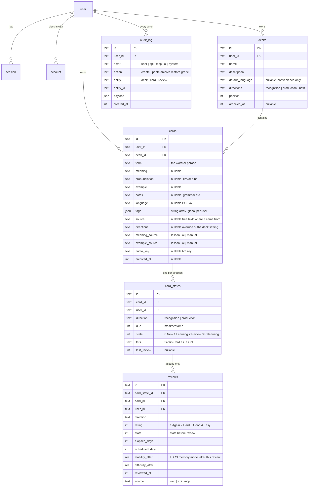

# Data model and API

Reference for what is in D1 and what the API returns. Source of truth is `packages/core/src/schema` for tables and `packages/core/src/types.ts` for request bodies. This page describes; it does not decide.

## Entities



All tables carry `created_at` and `updated_at` as millisecond integers. Ids are 19-character strings, time-prefixed so they sort by creation. Rows are never deleted by the app: decks and cards archive, reviews and audit rows are permanent.

The `user`, `session`, `account` and `verification` tables belong to Better Auth and are generated, not hand-written. Every app table has `user_id` so a second user is a policy change, not a migration.

### Why the scheduling state is JSON

`card_states.fsrs` holds the full ts-fsrs Card object (stability, difficulty, reps, lapses, learning step, due, last review). `due` and `state` are copied out into real columns so the queue can be queried without parsing JSON. If ts-fsrs adds a field, nothing needs a migration.

### Directions

`decks.directions` says how cards in the deck are asked: `recognition` (see the term, recall the meaning), `production` (see the meaning, produce the term) or `both`. A card may override with its own `directions`. Each concrete direction gets its own `card_states` row with its own schedule, because recognising and producing are different skills. When a deck switches to `both`, the missing state rows are created due now.

### Tags and source

Tags are labels on a card, global to the user, any number per card, stored as a JSON array until search or renaming needs a table. `source` is free text saying where the card came from. When AI capture arrives, pasted material becomes a `sources` row and cards point at it with `source_id`; the text column stays for hand-added cards.

### Why language is on the card

Decks can mix languages or hold non-vocabulary cards. `cards.language` is nullable. A null language means no audio and no language-specific AI for that card, and everything else works. `decks.default_language` only prefills new cards.

## API

All routes are under `/api`, JSON in and out, session cookie for auth. Everything except `/api/health` and `/api/auth/*` returns `401 {"error":"Sign in required"}` without a session. Validation failures return `400 {"error", "issues"}` with the Zod issues.

| Method | Path | Body | Returns |
| --- | --- | --- | --- |
| GET | `/api/health` | | `{ ok, name, time }` |
| ANY | `/api/auth/*` | | Better Auth (sign-in, session, sign-out) |
| GET | `/api/me` | | `{ id, name, email, image }` |
| GET | `/api/decks` | | `DeckSummary[]` |
| POST | `/api/decks` | `DeckInput` | `Deck` (201) |
| GET | `/api/decks/:id` | | `Deck` |
| GET | `/api/decks/:id/cards` | | `{ card: Card, state: CardState \| null }[]` newest first |
| POST | `/api/cards` | `CardInput` | `Card` (201). Also creates one `card_state` per direction, due now. |
| PATCH | `/api/cards/:id` | `CardPatch` | `Card` |
| POST | `/api/cards/:id/archive` | | `{ ok }` |
| POST | `/api/cards/:id/restore` | | `{ ok }` |
| GET | `/api/review/queue?deck=&limit=` | | `{ total, items: QueueItem[] }` |
| POST | `/api/review/grade` | `GradeInput` | `{ ok, due, state }` or `{ ok, duplicate: true }` |
| GET | `/api/audio/:cardId` | | 501 until text-to-speech is wired |

### Shapes

```ts
// Request bodies (packages/core/src/types.ts)
DeckInput  { name: string; description?: string; defaultLanguage?: string | null;
             directions?: "recognition"|"production"|"both" }
CardInput  { deckId: string; term: string; meaning?: string; pronunciation?: string;
             example?: string; notes?: string; language?: string | null; tags?: string[];
             source?: string; directions?: "recognition"|"production"|"both" | null;
             meaningSource?: "lesson"|"ai"|"manual";
             exampleSource?: "lesson"|"ai"|"manual" }
CardPatch  Partial<CardInput>
GradeInput { cardId: string; direction: "recognition"|"production"; rating: 1|2|3|4;
             reviewedAt?: string }   // client time, so offline grades keep their real timestamp

// Responses
DeckSummary { id, name, description, defaultLanguage, position, total: number, due: number }
QueueItem   { card: Card; direction; stateId: string; fsrsState: 0|1|2|3;
              next: { 1: ISODate; 2: ISODate; 3: ISODate; 4: ISODate } }  // what each grade would schedule
```

### Rules the API enforces

- A grade older than the state's last review is ignored and reported as `duplicate`. This is what makes offline replay safe.
- Every write appends to `audit_log` with an actor. The web UI writes `user`; the API and MCP will write their own actor so their changes are visible in the product.
- Archive instead of delete, always.
- `language` on a new card defaults to the deck's `default_language` when not given.

## Not decided yet

- One `meaning` string per card, or multiple senses as rows. Decide before the first deploy with real data.
- Holding back the second direction of a card until the next day, so seeing the term is not a giveaway for producing it later in the same session. Queue logic, not schema.
- ~~API keys and scopes for integrations.~~ Decided 5 September 2026, see [stack.md](stack.md): `apiKey` plugin for keys, `@better-auth/mcp` for OAuth, scopes `read` and `write`. Tables are generated by Better Auth. Cards gain `created_by`, and a settings row holds the meaning language.
- Tags as a JSON column (current) or a table, once search needs them.
