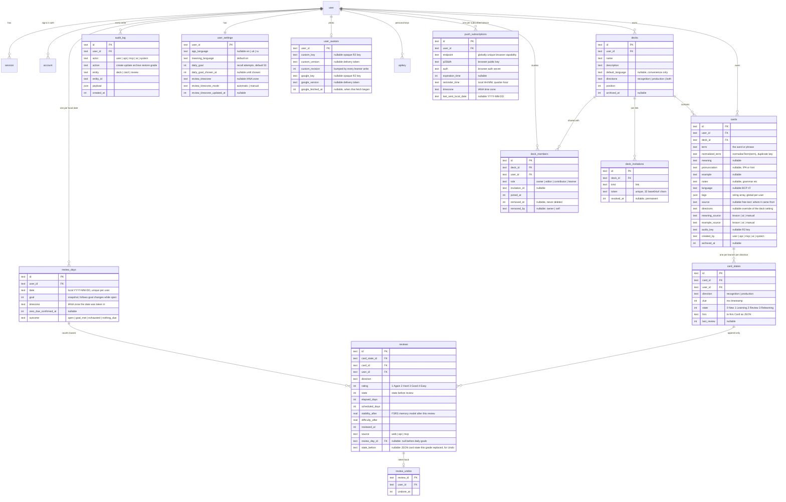

# Data model and API

Reference for what is in D1 and what the API returns. Source of truth is `packages/core/src/schema` for tables, `packages/core/src/types.ts` for request bodies and `packages/core/src/responses.ts` for responses. This page describes; it does not decide.

## Entities

All tables carry `created_at` and `updated_at` as millisecond integers. Ids are 19-character strings, time-prefixed so they sort by creation. Learning content is never deleted by the app: decks and cards archive, while reviews and audit rows are permanent. Push subscriptions are device capabilities, not learning content, and are deleted when the learner turns reminders off or the push service reports that the subscription has expired.

The `user`, `session`, `account`, `verification` and `apikey` tables belong to Better Auth and are generated, not hand-written. Every app table has `user_id` so a second user is a policy change, not a migration.

### Review days

A review day is one learner-local date measured against its streak goal. Attempts are counted from `reviews` less `review_undos`, never stored as a counter. A grade fixes `review_day_id` when it lands, in the review timezone of that moment, so a later timezone change never moves completed history. `outcome` only moves forward on a grade or a lower goal; Undo recomputes it and can reopen a day. Reviews from before daily goals have no day and still count as a reviewed day. The rules are in [the daily review goal proposal](proposals/daily-review-goal-and-rolling-queue.md) and live in `services/review-days.ts`.

### Shared decks

A deck's owner is `decks.user_id`. Everyone else who studies it has a `deck_members` row. Leaving or being removed sets `removed_at` and keeps the row; `removed_by = 'owner'` blocks the join link until a named invitation. `card_states` is unique per `(card_id, user_id, direction)`, so each learner of a shared card has their own schedule. Every read goes through `memberOf` in `services/members.ts`; every write to a deck's content requires the owner. [ADR 0011](adr/0011-a-shared-deck-is-one-deck-with-many-learners.md).

A deck has at most one unrevoked `deck_invitations` link, enforced by a partial unique index. Turning the link off sets `revoked_at` for good, and turning it on again inserts a new row with a new token. The token is a capability: it appears in the join URL and nowhere else, never in audit payloads, logs or error messages. `/join/<token>` is rendered by the product Worker; it shows up to three recent cards, and its title and Open Graph tags carry none. A signed-out visitor's link rides through sign-in in a ten-minute HttpOnly cookie, which lets `user.create.before` admit an account that is not on `ALLOWED_EMAILS`, and `session.create.after` completes the membership. Repeated joins make one membership and one audit row.

### Avatars

The learner's upload and the Google fallback sit in separate columns, and the upload wins while it exists. Both are 320 px WebP objects in the private `PRIVATE_IMAGES` bucket, re-encoded by the Images binding so no metadata survives, under random keys that name neither the learner nor the source. `/api/avatar/<version>` serves only the active version, with `private, no-store`; the client holds the bytes in memory through TanStack Query, so sign-out clears them. An upload or removal sends `If-Match` with `custom_revision` and gets 409 if the photo changed since. Each Google sign-in refreshes the fallback from the ID token's `picture`, fetched only from `*.googleusercontent.com`; a refresh that started earlier than the stored one is dropped, and a failed one keeps the previous photo and never blocks sign-in.

### Why the scheduling state is JSON

`card_states.fsrs` holds the full ts-fsrs Card object (stability, difficulty, reps, lapses, learning step, due, last review). `due` and `state` are copied out into real columns so the queue can be queried without parsing JSON. If ts-fsrs adds a field, nothing needs a migration.

### Directions

`decks.directions` says how cards in the deck are asked: `recognition` (see the term, recall the meaning), `production` (see the meaning, produce the term) or `both`. A card may override with its own `directions`. Each concrete direction gets its own `card_states` row with its own schedule, because recognising and producing are different skills. When a deck switches to `both`, the missing state rows are created due now.

### Tags and source

Tags are labels on a card, global to the user, any number per card, stored as a JSON array until search or renaming needs a table. `source` is free text saying where the card came from. When AI capture arrives, pasted material becomes a `sources` row and cards point at it with `source_id`; the text column stays for hand-added cards.

### Why language is on the card

Decks can mix languages or hold non-vocabulary cards. `cards.language` is nullable. A null language means no audio and no language-specific AI for that card, and everything else works. `decks.default_language` only prefills new cards.

## API

The API is documented by the running app: [`lymi.app/docs`](https://lymi.app/docs) is the documentation site, [`lymi.app/docs/api`](https://lymi.app/docs/api) its reference, and [`my.lymi.app/api/openapi.json`](https://my.lymi.app/api/openapi.json) the OpenAPI 3.1 document the reference renders. The OpenAPI document is generated from the route descriptions in `apps/web/src/server/routes` and the Zod schemas in `packages/core/src/types.ts` (request bodies) and `packages/core/src/responses.ts` (responses), so it cannot drift from the code. This page keeps only what the document does not say.

Three ways in, one shape on the server. A session cookie is the learner in the app, actor `user`, scope `write`. An `x-api-key` header is a personal key, actor `api`, with the key's scope. An OAuth bearer token is an MCP client, actor `mcp`. `apps/web/src/server/principal.ts` resolves all three into `{ user, actor, scope }`.

### Rules the API enforces

- Reads need any credential. Writes need the `write` scope, or 403.
- Grading, key management and the learner's photo are the learner's alone. Any key or token gets 403, whatever its scope.
- Join links are managed and followed only from the app. Reading, turning on, or turning off a deck's link needs the owner's session; joining needs the learner's session. Any key or token gets 403.
- A deck's content is the owner's alone. A member who edits, archives, or adds a card, or changes the deck, gets 403 whatever the credential. Deck responses carry `role` and `owner` so a client can tell.
- A duplicate (same normalised term and language as an active card anywhere in the learner's decks) is skipped and reported with the existing card, never rejected. Adds return one outcome per card sent. ADR 0004.
- A grade older than the state's last review is ignored and reported as `duplicate`. This is what makes offline replay safe.
- Every write appends to `audit_log` with its actor, and every card carries `created_by`, so Activity can show what integrations and the AI wrote.
- Archive learning content instead of deleting it. Device push subscriptions are removed when disabled or expired.
- `language` on a new card defaults to the deck's `default_language` when not given.
- Validation failures return `400 { error, issues }` with the Zod issues. Missing or bad credentials return `401 { error }`.

## Not decided yet

- One `meaning` string per card, or multiple senses as rows. Decide before the first deploy with real data.
- Holding back the second direction of a card until the next day, so seeing the term is not a giveaway for producing it later in the same session. Queue logic, not schema.
- Tags as a JSON column (current) or a table, once search needs them.
