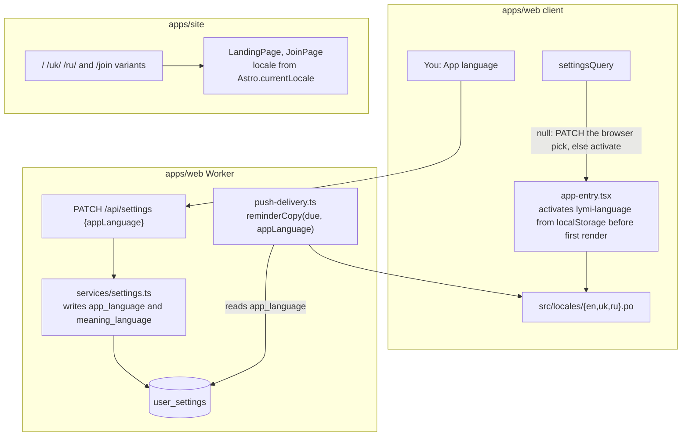

# Lymi speaks Ukrainian and Russian in the app and on the site

**Status:** Decided 12 September 2026. Phase 1 built the same day on `kateryna/localization-plumbing`; phases 2 and 3 not started. Scope is the product app, push reminders, and the site's landing and Join pages; docs stay English. The decisions are [ADR 0012](../adr/0012-interface-text-is-english-source-translated-by-lingui.md) and [ADR 0013](../adr/0013-app-language-is-one-setting-that-meaning-language-follows.md); the product case is the localization section of [Market differentiation and go-to-market](../proposals/market-differentiation-and-go-to-market.md#localization-as-a-differentiation-and-distribution-wedge).

## Done when

- A learner who picks Українська or Русский under You sees every interface string, date and plural in that language, on the phone and the desktop, after a reload and offline.
- Push reminders arrive in the learner's app language with correct plural forms.
- `lymi.app/uk/` and `lymi.app/ru/` serve the landing and Join pages with localized title, description and social metadata plus `hreflang` links, and the docs stay at their English URLs.
- `pnpm verify` fails on a string added without extraction or left untranslated.
- `pnpm test:e2e` passes in Chromium and WebKit with a spec that switches the app language.

## Shape

Each app has its own Lingui config and catalogs. The Worker shares the product client's catalogs.

## Constraints found by the spike

A spike on this stack passed `pnpm verify` and the Chromium e2e with one `<Trans>` per app, push copy on `msg` and `plural`, and a `/uk/` route. It settled four things the plan depends on:

- Vite 8 runs on Rolldown and `@vitejs/plugin-react` 6 has no `babel` option. Macros run through `@rolldown/plugin-babel` with `linguiTransformerBabelPreset()` from `@lingui/vite-plugin`, filtered to `src/`. The same pair goes under `vite.plugins` in `astro.config.mjs`.
- The Lingui 6 CLI needs Node 22.19 or newer. On 22.14 `lingui extract` exits 0 and writes nothing. `.nvmrc` moves to `22.22.3` and the root `package.json` engine to `>=22.19`, so a supported setup cannot run a silent no-op.
- `@lingui/core` reaches `@messageformat/parser`, which is CommonJS. The Workers test runner fails at startup if it sits in the Worker entry's static graph, so the Worker imports `@lingui/core` dynamically, the way it already imports `web-push`. Production and `pnpm dev` are unaffected.
- The missing-translation gate is `lingui({ failOnMissing: true })` on the Vite plugin, which fails the build `verify` already runs. `lingui compile` is not used: it writes `.js` files Biome then lints.

## Address form

Ukrainian says "ти" and Russian says "ты", the same register in both. Lymi's English is already on first-name terms, and modern personal consumer products in Ukrainian use "ти" while "ви" is the register of government services and system strings. The `translate` skill records it. Legal text on the site may stay formal.

## Phase 1: plumbing, every string wrapped, still English

Nothing visible changes and no learner data changes: no picker, no write to `app_language`. Done when `pnpm verify` and `pnpm test:e2e:chromium` pass and each screen matches its screenshot from before.

1. Install Lingui in `apps/web` with the Vite setup above, `lingui.config.ts` with `sourceLocale: "en"`, `locales: ["en", "uk", "ru"]`, catalogs at `src/locales/{locale}` covering `src/client` and `src/server`, PO format with `lineNumbers: false`. Bump `.nvmrc` and the root `engines.node`.
2. Add `AppLanguage`, a `z.enum(["en", "uk", "ru"])` in `packages/core/src/types.ts`, and a nullable `app_language` column on `user_settings`. `appLanguage: AppLanguage` goes on `SettingsPatch` and `SettingsOut`. `meaningLanguage` leaves `SettingsPatch` and stays on `SettingsOut` as a derived field, so neither the API nor MCP's `update_settings` can set it apart from the app language. `updateSettings` writes `meaning_language` from `appLanguage`.
3. Add `lib/i18n.ts` with `pickLocale(navigator.languages)` and `activate(locale)`, which loads the catalog, sets `document.documentElement.lang` and stores `lymi-language`. Before the first render, the signed-in shell activates the stored value if it is an `AppLanguage` and the browser pick otherwise; the bare shell (`/login`, `/consent`) always uses the browser pick and ignores the stored value, and sign-out clears it. Wrap the router in `I18nProvider`.
4. Add `settingsQuery` and a root effect that activates a stored `appLanguage`. A null value activates the browser pick without writing it; the write and the picker wait for phase 2, so an English interface can never sit on Ukrainian enrichment.
5. Wrap every string: `<Trans>` in JSX, `t` for attributes, `msg` for constants, `plural` for the seven ternaries. Dates through `i18n.date()`, language names through `Intl.DisplayNames([i18n.locale])`. Client validation messages move into components with `t`; the core Zod schema still decides validity.
6. Replace physical Tailwind direction classes with logical ones and add the rule to the Styling convention in `CLAUDE.md`.
7. Localize `reminderCopy(due, locale)` through a dynamic `@lingui/core` import; the candidate query joins `user_settings` for `app_language`, null meaning `en`.
8. Add `i18n:extract` and `i18n:check` (extract, then `git diff --exit-code` on the catalogs) and put `i18n:check` in `verify` after `check`.
9. Write the `translate` skill: read `CONTEXT.md` for terms and `DESIGN.md` for voice, a glossary of the product words in both languages, keep ICU placeholders and `#`, write one, few and many, keep labels phone-width, never translate "Lymi", informal address.

## Phase 2: Ukrainian and Russian

Done when the app runs in both languages, `pnpm verify` and `pnpm test:e2e` pass in both browsers, and a pass on a real iPhone in standalone mode finds no clipped label.

1. Run the `translate` skill on both catalogs. The PR description lists every message the agent was unsure about.
2. Add the **App language** select under You with each option in its own language, and the root effect that writes the browser pick when `appLanguage` is null. Turn on `failOnMissing: true` in the product Vite config.
3. Test `reminderCopy` for 1, 2, 5 and 21 cards in all three locales.
4. Add `e2e/language.spec.ts` with a `language` account: sign in, choose Українська under You, reload, expect `html[lang="uk"]` and the Today and You headings in Ukrainian, then switch back.
5. Confirm the sign-in page, which has no settings, follows the browser pick.

## Phase 3: the site

Done when `pnpm verify`, `pnpm deploy:check:site` and `pnpm test:e2e` pass, `/uk/` and `/ru/` are live with `hreflang`, and a build check reads localized `<title>`, `description` and `og:` tags from `dist/uk/index.html`.

1. Configure `i18n: { defaultLocale: "en", locales: ["en", "uk", "ru"] }` and the Lingui Vite pair in `astro.config.mjs`; add the site's own `lingui.config.ts` and catalogs.
2. Add `lib/i18n.ts` with `pageI18n(locale)`; `LandingPage` and `JoinPage` take `locale={Astro.currentLocale}` and wrap their view in `I18nProvider`. Astro prerenders the island, so translated text is in the HTML. The page wrappers resolve the title, description and Open Graph and Twitter text as `msg` descriptors through the same instance and pass them to `BaseLayout`, so `/uk/` never advertises English metadata.
3. Add `pages/uk/` and `pages/ru/` wrappers for `index` and `join`. Docs pages are not duplicated.
4. Set `lang` from `Astro.currentLocale` in `BaseLayout.astro`, the canonical per locale, and `hreflang` for `en`, `uk`, `ru` and `x-default` on landing and Join only. Extend `sitemap.xml.ts`.
5. Add a footer language row built with `getRelativeLocaleUrl`. The beta form shows localized messages; `/api/beta` stays English.
6. Run the `translate` skill and turn on `failOnMissing: true`. Marketing copy gets a harder read than app copy.

## Not in this plan

Language-pair enrichment fields, translated docs, localized API errors or MCP tool descriptions, right-to-left layout, a hosted translation editor, App Store metadata.

## Suggested skills

`translate` (new in phase 1), `impeccable` and `ux-writing` for the setting and the footer row, `lymi-e2e` for the spec, `typescript-best-practices`, `technical-writing` for the PR descriptions.
