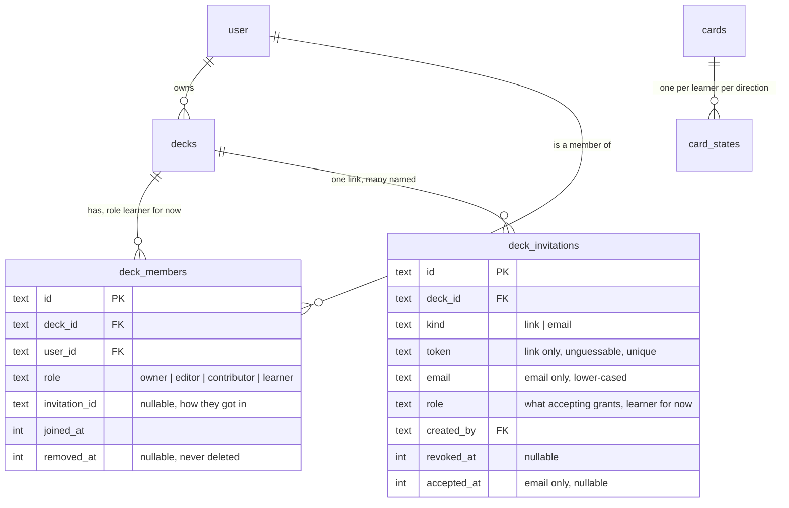
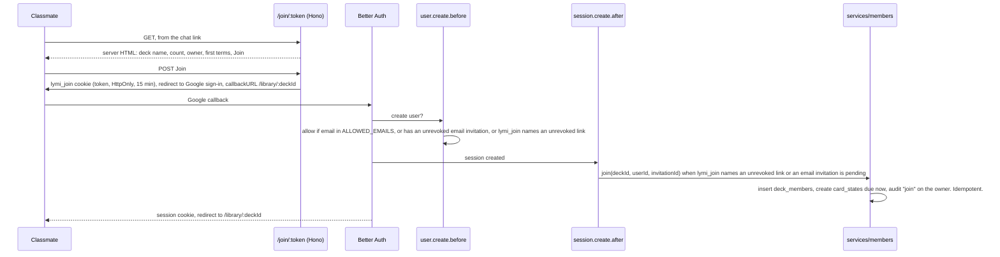

# Shared decks

**Status:** Planned 12 September 2026, nothing built. Decisions are in [ADR 0011](../adr/0011-a-shared-deck-is-one-deck-with-many-learners.md), vocabulary in [CONTEXT.md](../../CONTEXT.md), the options that lost in [the proposal](../proposals/shared-decks.md).

## Acceptance

The owner posts one link in a class chat. A classmate opens it on a phone, sees the deck's name, card count, and owner, signs in with Google, and lands in Today with the deck in their Library. They review on their own schedule. Cards the owner adds later are new in the classmate's next session. The owner sees who joined and can remove anyone; a removed classmate loses the deck from their Library and keeps their reviews in the database. Step 6 automates this paragraph.

## Data model

The owner stays `decks.user_id`; `deck_members` holds everyone else. `deckAccess({ db, userId }, deckId)` returns the role or null and is the one place authorization lives. The `card_states` unique index becomes `(card_id, user_id, direction)`; existing rows already carry the right `user_id`, so the migration swaps an index and moves no data.

## Join flow

The join completes in the session hook because `safeProductReturnPath` in `apps/web/src/shared/origins.ts` only returns sign-in to the paths in `PRODUCT_PATHS`, and `/join` is not one. A hook also runs once per sign-in whatever the browser does with the callback page. A signed-in learner who opens the link gets the same page, and **Join** calls `join` directly.

## Order of work

Each step leaves the app deployable.

1. **Membership and read paths.** One migration: `deck_members` and the `card_states` index swap. `deckAccess` and `visibleDecks` in `services/decks.ts`. Route `listDecks`, `getDeck`, `listDeckCards`, `reviewQueue`, `reviewHistory`, the stats queries, and the reminder query in `push-delivery.ts` through membership, filtering states on the caller's `user_id`. Writes keep the owner filter. Adding a card creates states for every member. New `services/members.ts` with `join` and `leave`; `join` creates states the way `backfillDirection` does. Tests: a member sees the deck and its cards, grades their own state, cannot write a card; the owner's queue is unchanged.
2. **Invitations and the front door.** `deck_invitations`. The `user.create.before` hook allows an email in `ALLOWED_EMAILS`, an unrevoked email invitation, or a `lymi_join` cookie naming an unrevoked link. A `session.create.after` hook completes the join. Services: `createLink`, `revokeLink`, `inviteEmail`, `revokeInvitation`, `listMembers`, `removeMember`, with API routes. Tests: each gate, a revoked token, and a repeated callback joining once.
3. **The join page.** `GET /join/:token` next to the API routes, returning server HTML with the Lymi tokens inlined and `og:title`, `og:description`, `og:image`. It shows the deck's name, card count, owner, and first few terms. Three states: live, turned off, deck archived. Signed out shows **Join with Google**; signed in shows **Join**, or **Open deck** for a member. `POST /join/:token` sets the cookie and redirects. Load `impeccable` and `ux-writing` first. Check the preview by fetching the route and by pasting the link into a chat.
4. **Sharing in the app.** A **Sharing** section in deck settings: the join link with copy and turn off, invite by email, the member list with joined dates and remove. Library shows shared decks with the owner's name. A member's deck screen is read-only, with **Leave deck** in its settings. Activity shows a join as "Anna joined Estonian A2".
5. **API and MCP.** Deck responses gain `role`. Writes by anyone but the owner return 403 through every door. `list_decks` and `get_deck` return the role. Update the OpenAPI descriptions and `docs/data-model.md`.
6. **End to end.** One Playwright test with two browser contexts, both signed in through `/login?dev=1` as in `e2e/auth.ts`: the owner turns on the link, the second context opens it, joins, sees the deck, reviews a card; the owner adds a card; the second context sees it as new; the owner removes the member; the deck is gone from the member's Library. Run `pnpm test:e2e` in both browsers, since the page is a navigation and sign-in path.

## Pull requests

| PR | Steps | Gate |
| --- | --- | --- |
| 1. Membership | 1 | Unit tests for read paths and write refusals. `pnpm test:e2e:chromium` for the owner's flows. |
| 2. Front door | 2, 3 | Hook tests. A fetch of `/join/<token>` shows the Open Graph tags. Deploy and try with one classmate. |
| 3. Sharing in the app | 4, 6 | The two-context Playwright test. `pnpm test:e2e`, both browsers. |
| 4. Integrations | 5 | Unit tests for 403 through a key and a token. OpenAPI snapshot updated. |

PR 4 can follow PR 1 in any order.

## Constraints checked against the installed code

- Better Auth 1.7.2: `user.create.before(user, context)` and `session.create.after(session, context)` receive a `GenericEndpointContext | null`, so the cookie is readable in both. Treat null as "no link".
- The Worker serves the SPA from `app.notFound` in `apps/web/src/server/index.ts`, so `/join/:token` needs no ordering trick.
- The public site renders Open Graph tags in `apps/site/src/layouts/BaseLayout.astro`. The join page inlines its own head rather than sharing code across apps.

## Not in this pass

Editor and contributor roles in the interface, a contribution flow, email delivery for named invitations, personal notes or pausing on shared cards, a copy for a member who leaves, any view of a member's progress, transferring ownership, and a public deck directory. Trying the deck before joining is described in [the proposal](../proposals/shared-decks.md#a-later-direction-try-the-deck-before-joining); the first terms on the join page in step 3 are its seed.

## Skills for the implementing session

`wrangler` and `workers-best-practices` for the route and hooks, `typescript-best-practices` throughout, `impeccable` and `ux-writing` for the join page and the Sharing section, `lymi-e2e` for step 6, `technical-writing` for docs and the PR.
