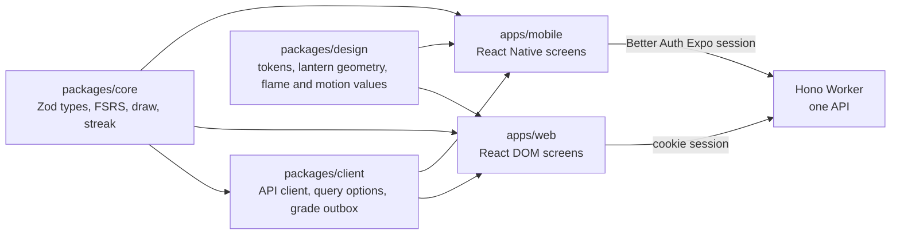

# Native mobile app

A phone app is worth building when it is better than the PWA at the two daily jobs: catching a word while the lesson is fresh, and reviewing every evening without being asked. The proof of concept in [`apps/mobile`](../../apps/mobile/README.md) showed that on iOS 26 with demo data, and [ADR 0029](../adr/0029-the-phone-app-is-expo-react-native-sharing-core.md) records the decision: Expo React Native, with screens written for the phone and everything under them shared with the web.

## Why not the September leaning

The September version of this proposal leaned to Capacitor around the existing React app. The proof of concept argued the other way. The system chrome, sheets, peek menus, haptics and widgets are what made it feel native, and a WebView can only imitate them. `packages/core` already ran unchanged under Hermes, so the cost is two sets of screens, not two products.

## Stack

Versions checked on 11 October 2026.

| Layer | Choice | Lost to it |
| --- | --- | --- |
| Framework | Expo SDK 57, React Native 0.86, New Architecture | Capacitor; a WebView shell |
| Navigation | Expo Router: native stacks, form sheets, `Link.Preview`; our own tab bar | System `NativeTabs`, kept as a fallback |
| Styling | Uniwind (Tailwind v4), class names shared with the web | NativeWind v5, still a release candidate |
| Motion | Reanimated 4 and Gesture Handler, with Skia for the lantern next | Moti, no longer maintained |
| Icons and type | Lucide and Onest, as on the web | SF Symbols and San Francisco |
| Widgets | `expo-widgets` with `@expo/ui` | `@bacons/apple-targets`, the fallback for full WidgetKit |
| Data | TanStack Query with an MMKV persister, Better Auth's Expo plugin, Lingui | — |

No Expo account is needed to build: `npx expo run:ios` builds with the local Xcode. Expo's cloud services are optional. The Apple Developer Program ($99 a year) is needed for TestFlight and the App Store.

## Sharing with the web

Product rules stay in `packages/core`. Screens keep the web's component names, so a design-system rule reads the same on both. Today `pnpm tokens` in `apps/mobile` reads the web's `styles.css`; `packages/design` replaces that.

## Design language

Unchanged from the web: both rooms and their colours, Onest, the lantern and every flame rule, amber meaning act, one primary per view, the reveal choreography, the end of a review, the seven lights and Lucide icons.

Decided for the phone in the proof of concept:

- **Navigation** is the web's pill, drawn in Liquid Glass tinted toward the room. The system tab bar and an opaque pill remain switchable options in the **You** tab.
- **A tab names itself in the top bar**, beside the streak and capture. There is no large title row and no avatar, because You is a tab.
- **Today leads with the lit room:** no plate, the lantern lights the top of the screen.
- **Grades are plates** under the card, 64 px tall, and the card shrinks to make room. Glass grades and swipe stay as options.
- **Onest everywhere** Lymi draws text. Lymi draws its own persistent chrome; Apple draws only what comes and goes, such as long-press menus, the share sheet, alerts and the keyboard, in SF.
- **Display type keeps a 1.2 line box**, because iOS clips any glyph that rises past it.
- **Haptics:** a light tap on reveal, one soft tap for every grade, a success haptic at the goal. No Undo toast while grading.

Still open: which widget ships (a calm **Lantern** in small and medium, or the **Week** of seven lights), how Undo works in a phone review, and the capture sheet, which is not yet built from Lymi's form controls.

## Native features, in order of value

1. **Widgets.** Built in the proof of concept.
2. **Share to Lymi** from Safari, Notes or a transcript, the biggest win for capture.
3. **Reminders** at a chosen time, with no streak pressure.
4. **Shortcuts and Control Center:** "Start review", "How many are due".
5. **Spotlight:** search a word from the Home Screen.

## Delivery

1. **Base.** Merge `apps/mobile` on demo data, with this proposal and ADR 0029.
2. **Shared design values.** `packages/design` holds the tokens, the lantern's geometry, flame values and motion presets; the web, the site and the phone import it.
3. **Shared client.** `packages/client` holds the API client, query options and grade outbox, moved out of `apps/web` with no change in behaviour.
4. **Sign-in.** Better Auth's Expo plugin, the `lymi://` scheme as a trusted origin, the session in SecureStore.
5. **Real data.** Today, Review with the offline outbox, Library and the deck page.
6. **Phone design system.** Form controls, menus and sheets under the web's names, with an in-app design screen; then Add a word redesigned with them.
7. **Craft foundations.** Skia for the lantern, keyboard-following inputs, Dynamic Type for Onest.
8. **On a device.** A release build profiled on a real phone, then TestFlight.
9. **Native features.** The chosen widget, Share to Lymi, then reminders.

## Risks

- **Two sets of screens.** Shared packages and the parity rule keep logic in one place, but every screen is built twice.
- **Taps dropped during animations in the debug build.** Settle this in step 8 before any performance claim.
- **Young APIs.** `NativeTabs` is still `unstable-native-tabs` on SDK 57, and `expo-widgets` is months old.

## Sources checked

- [Expo SDK 57](https://docs.expo.dev/versions/v57.0.0/), [Widgets](https://docs.expo.dev/versions/latest/sdk/widgets/), [Glass effect](https://docs.expo.dev/versions/latest/sdk/glass-effect/), [Monorepos](https://docs.expo.dev/guides/monorepos/), [Pricing](https://expo.dev/pricing)
- [Uniwind theming](https://docs.uniwind.dev/theming/global-css)
- [Better Auth Expo integration](https://www.better-auth.com/docs/integrations/expo)
- [Lingui with React Native](https://lingui.dev/tutorials/react-native)
