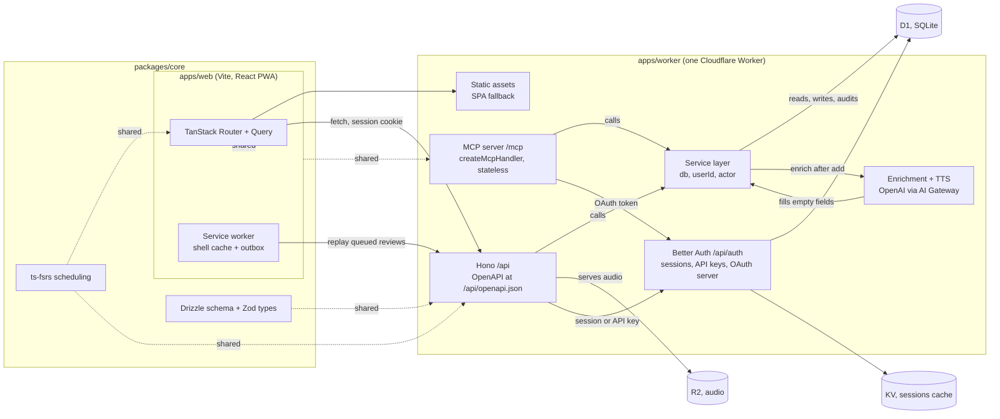

# Technical stack

**Status:** Agreed 5 September 2026, integrations layer decided the same day. Edit in place as decisions change. Vocabulary is in [CONTEXT.md](../CONTEXT.md).

Everything runs on Cloudflare. One Worker serves the app, the API, auth and the MCP server. The client is a React PWA that behaves like a native app on the phone and like a keyboard-driven web app on the desktop. Shared logic lives in a package a future React Native app can import unchanged.

## Shape



## Decisions

### Client: Vite + React + TanStack Router and Query, as a PWA

A single-page app, not a server-rendered site. The app sits behind a login, so there is nothing for SSR to gain, and a static shell is what makes a PWA open instantly and work offline. TanStack Router gives typed routes and a proper mobile navigation model. TanStack Query, with its IndexedDB persister, is the cache that makes the review screen usable on a train.

`vite-plugin-pwa` handles the manifest and Workbox service worker. The app captures Chromium's install event for its in-app button and shows manual instructions on browsers that do not expose one. The shell is precached. Data goes through Query's cache plus a small outbox in IndexedDB (Dexie) for reviews graded offline, replayed when the connection returns.

Review reminders use standards-based Web Push with VAPID, sent directly by the same Worker. Subscriptions and local reminder times are per device in D1. One UTC Cron Trigger runs every 15 minutes, evaluates each device in its stored IANA timezone, sends only when active cards are due, and atomically records the local date before delivery so retries do not duplicate a reminder. See ADR 0006.

Alternative considered: TanStack Start or React Router 7 with SSR on Workers. Fine products, but SSR adds a rendering path and a hydration step for no user-visible benefit here. Revisit if a public marketing site needs to share the codebase.

### Feels native on the phone

This is a design requirement with a technical checklist:

- `display: standalone`, `theme-color` per theme, splash icons, iOS `apple-mobile-web-app-*` meta.
- `100dvh` layouts, safe-area insets, no body scroll, scroll containers per screen.
- Bottom sheet via Vaul, page transitions via the View Transitions API with a Motion fallback.
- `touch-action: manipulation`, 44 px targets, 16 px inputs, haptics via `navigator.vibrate` where available.
- Keyboard shortcuts and a command palette on desktop; the same routes, a different shell.

The bar is "could be mistaken for native." Every screen is checked on a real iPhone in standalone mode before it ships.

### UI: Tailwind v4 + shadcn/ui, tokens from DESIGN.md

Tailwind v4 reads design tokens as CSS variables in OKLCH, which is exactly what DESIGN.md defines. shadcn/ui supplies the accessible primitives (dialog, popover, dropdown, tabs) and gets restyled to Lymi's radius, type and palette. Motion for the lantern and transitions.

### Server: one Cloudflare Worker with Hono

Hono routes `/api/*`, `/api/auth/*` and `/mcp`. Everything else is a static asset with SPA fallback, so page loads do not touch the Worker. The Cloudflare Vite plugin runs the same Worker locally.

Alternative considered: Pages plus separate Functions. Workers with static assets is the current path and deploys as one unit.

### Data: D1 with Drizzle

D1 is SQLite at the edge. Drizzle gives a typed schema shared with the client and generates migrations. One database for now, tenanted by `user_id` from day one so adding users later is a policy change, not a migration. Review history is append-only.

Language lives on the card, not the deck. `cards.language` is nullable; a deck may carry a default as a convenience. Detection fills it in at capture time and a chip lets you correct it. Cards without a language get no audio and no language-specific enrichment, and everything else works the same, so decks can mix languages or hold content that is not vocabulary at all.

Later option: a Durable Object per user holding its own SQLite, which turns sync and offline into a solved problem. Not needed for one user.

### Auth: Better Auth on the Worker

Better Auth runs on Workers, supports D1 natively as of 1.5, and does social login plus sessions, API keys for the public API, and an Expo plugin for the React Native app later. Google is the only sign-in provider at launch. An allowlist of one email keeps the app private until that changes.

Known issue to watch: a reported bug where sessions expire after five minutes with D1 and KV. Test session refresh before relying on it.

Cloudflare Access was considered as an interim and rejected. Better Auth is built first so the API and MCP tokens have one auth system from day one.

Three ways in, one system:

| Caller | Credential | Better Auth piece |
| --- | --- | --- |
| The web app | Session cookie | core |
| curl, scripts, Claude Code | Personal API key, made and revoked in Settings | `apiKey` plugin |
| Claude Desktop, Codex, other MCP clients | OAuth 2.1 access token | `@better-auth/mcp` plugin, which makes this Worker the authorization server |

Claude Desktop and Codex both require OAuth for remote MCP servers, which is why a bearer key alone was not enough. `@better-auth/mcp` (Better Auth 1.7) serves the `.well-known` metadata, the consent page and JWT access tokens. The Worker checks tokens against its own JWKS with no database hit. Cloudflare's `workers-oauth-provider` was the earlier plan and is no longer needed.

Every key and every OAuth grant carries one scope, `read` or `write`. Write allows creating, editing and archiving decks and cards. Nothing an integration holds can grade a review.

### Spaced repetition: ts-fsrs

FSRS in TypeScript, in `packages/core`, used by the client (to schedule offline) and the server (to validate and persist). Grades and intervals are the algorithm's, not invented.

### AI: enrichment only, OpenAI through Cloudflare AI Gateway

**The server does not extract vocabulary from lessons. The MCP client does.** Claude Desktop or Codex already holds the transcript and a model, so it reads the lesson and calls `add_cards`. That keeps the Worker's AI to one job, enrichment: fill the empty fields on a card (meaning, example, pronunciation, language) and leave every field that already has text alone.

Enrichment runs in the background after any add that leaves fields empty, whether the card came from the web quick-capture sheet or from an integration. Typing "sbrigarsi" on the phone and finding the meaning there by the time you open the deck is the point. Each filled field is stored with `source: "ai"` so the UI labels it. Meanings are written in the learner's meaning language, a per-user setting, English by default.

OpenAI is the vendor for both text and speech, through AI Gateway for logging, caching and rate limits. Claude for text was considered and set aside to keep one key. Text goes through a small `Provider` interface in `packages/core` with one implementation, so swapping is one file. Workers AI is a fallback for cheap tasks like language detection.

### MCP: stateless handler in the same Worker

`createMcpHandler` from the Agents SDK at `/mcp`, Streamable HTTP, no Durable Object. `McpAgent` was the earlier plan and is deprecated. Authorization is the Better Auth OAuth server above.

Tools call the same service layer the REST routes call, so MCP cannot bypass product rules and every write lands in the audit log with actor `mcp`. The tool set: list decks, get deck, search cards, add cards, update card, archive card, restore card, due counts, enrich. There is no delete tool because the app has no delete. Claude Desktop does not support elicitation, so the server cannot ask "are you sure". Archive being reversible is the safety.

### Integrations: cards land as cards

A card added through the API or MCP is an ordinary card from the moment it lands. There is no proposals table and no approval step. In its place, an **Activity** view in Settings lists every write made by an integration or the AI, and you can inspect, edit or archive from there. Cards carry a `created_by` actor so Activity can filter without parsing the audit log.

Adds take one card or many. A lesson produces 20 to 40 terms, and one tool call per term is 40 model turns. A **duplicate** is a card whose normalised term and language match an active card anywhere in your decks. A duplicate is skipped, never rejected, and the response names the existing card, so re-running the same call is safe. A card with no language only matches other cards with no language.

### API: a service layer and generated docs

Route logic lives in service functions that take `db`, `userId` and `actor`. Hono routes and MCP tools are thin callers. The OpenAPI document is generated from the Zod schemas in `packages/core` and served at `/api/openapi.json`. The documentation site at `/docs` renders it, alongside hand-written guides; `/api/docs` redirects there.

### Audio: R2

Pronunciation audio is generated once with OpenAI text-to-speech, stored in R2, and served through the Worker with caching.

### Repo: pnpm workspace

```
lymi/
  apps/web          One deployable: Vite React PWA client + Hono Worker
    src/client      Routes, components, styles (Tailwind v4 tokens from DESIGN.md)
    src/server      Hono app, Better Auth, API routes, static-asset fallback
    migrations      Drizzle-generated SQL for D1
  packages/core     Drizzle schema, Zod types, ts-fsrs scheduling, ids
  design/           The identity board
  docs/             This file and the brief
```

Client and Worker live in one app because the Cloudflare Vite plugin builds and serves them as one unit; splitting them would only add a second deploy. `packages/core` is the part a React Native app imports later. A `packages/ui` for shared tokens can be split out when there is a second client.

Two workspace details worth knowing. `drizzle-orm` is a dependency of `packages/core` only and is re-exported as `@lymi/core/db`, because better-auth pulls in kysely and pnpm would otherwise build two copies of drizzle with incompatible types. And the Better Auth tables are generated, not hand-written: `pnpm --filter @lymi/web auth:schema` reads `src/server/auth-cli.ts` and writes `packages/core/src/schema/auth.ts`.

### Tooling

TypeScript strict. Biome for lint and format. Vitest for `packages/core` now, `@cloudflare/vitest-pool-workers` for Worker tests when the API grows. Playwright with an iPhone viewport for the review flow, not yet added. Wrangler for deploys, GitHub Actions or Workers Builds for CI. Cloudflare Workers Logs (observability is on in wrangler.jsonc) for errors.

Local development accepts email and password sign-in so the app is usable before Google is configured. It is enabled only when `APP_URL` starts with `http://localhost`.

## Decided

- Sign-in: Google only at launch. Apple can be added when React Native arrives.
- Domain: lymi.app, Worker on the apex. Register before the first deploy.
- Auth: Better Auth from the start, no Cloudflare Access interim.
- AI: OpenAI for text and speech, through AI Gateway.
- Integrations (5 September 2026): MCP clients are Claude Desktop and Codex first, so OAuth from day one via `@better-auth/mcp`. Personal API keys via the `apiKey` plugin. Two scopes, `read` and `write`.
- Cards from integrations are ordinary cards. No proposals table. Activity in Settings is the oversight.
- Duplicate means same normalised term and same language anywhere in the learner's decks. Skipped and reported, never rejected.
- The server enriches, the MCP client extracts. Enrichment is automatic, background, fills only empty fields.
- Meaning language is a per-user setting, English by default.
- Integrations never grade reviews.
- Not in the integrations pass: text-to-speech stays a stub, no scopes finer than read and write.

## Sources

- [Full-stack development on Cloudflare Workers](https://blog.cloudflare.com/full-stack-development-on-cloudflare-workers/)
- [Cloudflare Vite plugin](https://developers.cloudflare.com/workers/vite-plugin/)
- [Static assets and SPA fallback](https://developers.cloudflare.com/workers/static-assets/)
- [Better Auth 1.5](https://better-auth.com/blog/1-5)
- [Better Auth + Cloudflare Workers integration guide](https://medium.com/@senioro.valentino/better-auth-cloudflare-workers-the-integration-guide-nobody-wrote-8480331d805f)
- [better-auth-cloudflare](https://github.com/zpg6/better-auth-cloudflare)
