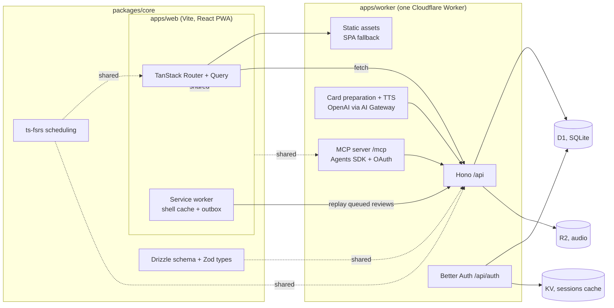

# Technical stack

**Status:** Agreed 5 September 2026. Edit in place as decisions change.

Everything runs on Cloudflare. One Worker serves the app, the API, auth and the MCP server. The client is a React PWA that behaves like a native app on the phone and like a keyboard-driven web app on the desktop. Shared logic lives in a package a future React Native app can import unchanged.

## Shape



## Decisions

### Client: Vite + React + TanStack Router and Query, as a PWA

A single-page app, not a server-rendered site. The app sits behind a login, so there is nothing for SSR to gain, and a static shell is what makes a PWA open instantly and work offline. TanStack Router gives typed routes and a proper mobile navigation model. TanStack Query, with its IndexedDB persister, is the cache that makes the review screen usable on a train.

`vite-plugin-pwa` handles the manifest, install prompt and Workbox service worker. The shell is precached. Data goes through Query's cache plus a small outbox in IndexedDB (Dexie) for reviews graded offline, replayed when the connection returns.

Alternative considered: TanStack Start or React Router 7 with SSR on Workers. Fine products, but SSR adds a rendering path and a hydration step for no user-visible benefit here. Revisit if a public marketing site needs to share the codebase.

### Feels native on the phone

This is a design requirement with a technical checklist:

- `display: standalone`, `theme-color` per theme, splash icons, iOS `apple-mobile-web-app-*` meta.
- `100dvh` layouts, safe-area insets, no body scroll, scroll containers per screen.
- Bottom sheet via Vaul, page transitions via the View Transitions API with a Motion fallback.
- `touch-action: manipulation`, 44 px targets, 16 px inputs, haptics via `navigator.vibrate` where available.
- Keyboard shortcuts and a command palette on desktop; the same routes, a different shell.

The bar is "could be mistaken for native." Every screen is checked on a real iPhone in standalone mode before it ships.

### UI: Tailwind v4 + shadcn/ui, tokens from DESIGN.md

Tailwind v4 reads design tokens as CSS variables in OKLCH, which is exactly what DESIGN.md defines. shadcn/ui supplies the accessible primitives (dialog, popover, dropdown, tabs) and gets restyled to Lymi's radius, type and palette. Motion for the lantern and transitions.

### Server: one Cloudflare Worker with Hono

Hono routes `/api/*`, `/api/auth/*` and `/mcp`. Everything else is a static asset with SPA fallback, so page loads do not touch the Worker. The Cloudflare Vite plugin runs the same Worker locally.

Alternative considered: Pages plus separate Functions. Workers with static assets is the current path and deploys as one unit.

### Data: D1 with Drizzle

D1 is SQLite at the edge. Drizzle gives a typed schema shared with the client and generates migrations. One database for now, tenanted by `user_id` from day one so adding users later is a policy change, not a migration. Review history is append-only.

Language lives on the card, not the deck. `cards.language` is nullable; a deck may carry a default as a convenience. Detection fills it in at capture time and a chip lets you correct it. Cards without a language get no audio and no language-specific enrichment, and everything else works the same, so decks can mix languages or hold content that is not vocabulary at all.

Later option: a Durable Object per user holding its own SQLite, which turns sync and offline into a solved problem. Not needed for one user.

### Auth: Better Auth on the Worker

Better Auth runs on Workers, supports D1 natively as of 1.5, and does social login plus sessions, API keys for the public API, and an Expo plugin for the React Native app later. Google is the only sign-in provider at launch. An allowlist of one email keeps the app private until that changes.

Known issue to watch: a reported bug where sessions expire after five minutes with D1 and KV. Test session refresh before relying on it.

Cloudflare Access was considered as an interim and rejected. Better Auth is built first so the API and MCP tokens have one auth system from day one.

### Spaced repetition: ts-fsrs

FSRS in TypeScript, in `packages/core`, used by the client (to schedule offline) and the server (to validate and persist). Grades and intervals are the algorithm's, not invented.

### AI: OpenAI through Cloudflare AI Gateway

Card preparation (extract vocabulary from a lesson, propose meaning, example, grammar note) and pronunciation audio both use the OpenAI API, called through Cloudflare AI Gateway for logging, caching and rate limits. OpenAI is the pick for two reasons: its text-to-speech voices are better for language audio, and the prices are lower for this workload.

Text goes through a small `Provider` interface in `packages/core` with one implementation. Swapping models or vendors later is one file. Every generated field is stored with `source: "ai"` so the UI can label it. Workers AI is a fallback for cheap tasks like language detection.

### MCP: Cloudflare Agents SDK

`McpAgent` from the Agents SDK with `workers-oauth-provider` for authorization. Tools are thin wrappers over the same API handlers the UI uses, so MCP cannot bypass product rules. Destructive tools require confirmation and everything is written to the same audit log the UI shows.

### Audio: R2

Pronunciation audio is generated once with OpenAI text-to-speech, stored in R2, and served through the Worker with caching.

### Repo: pnpm workspace

```
lymi/
  apps/web          One deployable: Vite React PWA client + Hono Worker
    src/client      Routes, components, styles (Tailwind v4 tokens from DESIGN.md)
    src/server      Hono app, Better Auth, API routes, static-asset fallback
    migrations      Drizzle-generated SQL for D1
  packages/core     Drizzle schema, Zod types, ts-fsrs scheduling, ids
  design/           The identity board
  docs/             This file and the brief
```

Client and Worker live in one app because the Cloudflare Vite plugin builds and serves them as one unit; splitting them would only add a second deploy. `packages/core` is the part a React Native app imports later. A `packages/ui` for shared tokens can be split out when there is a second client.

Two workspace details worth knowing. `drizzle-orm` is a dependency of `packages/core` only and is re-exported as `@lymi/core/db`, because better-auth pulls in kysely and pnpm would otherwise build two copies of drizzle with incompatible types. And the Better Auth tables are generated, not hand-written: `pnpm --filter @lymi/web auth:schema` reads `src/server/auth-cli.ts` and writes `packages/core/src/schema/auth.ts`.

### Tooling

TypeScript strict. Biome for lint and format. Vitest for `packages/core` now, `@cloudflare/vitest-pool-workers` for Worker tests when the API grows. Playwright with an iPhone viewport for the review flow, not yet added. Wrangler for deploys, GitHub Actions or Workers Builds for CI. Cloudflare Workers Logs (observability is on in wrangler.jsonc) for errors.

Local development accepts email and password sign-in so the app is usable before Google is configured. It is enabled only when `APP_URL` starts with `http://localhost`.

## Decided

- Sign-in: Google only at launch. Apple can be added when React Native arrives.
- Domain: lymi.app, Worker on the apex. Register before the first deploy.
- Auth: Better Auth from the start, no Cloudflare Access interim.
- AI: OpenAI for text and speech, through AI Gateway.

## Sources

- [Full-stack development on Cloudflare Workers](https://blog.cloudflare.com/full-stack-development-on-cloudflare-workers/)
- [Cloudflare Vite plugin](https://developers.cloudflare.com/workers/vite-plugin/)
- [Static assets and SPA fallback](https://developers.cloudflare.com/workers/static-assets/)
- [Better Auth 1.5](https://better-auth.com/blog/1-5)
- [Better Auth + Cloudflare Workers integration guide](https://medium.com/@senioro.valentino/better-auth-cloudflare-workers-the-integration-guide-nobody-wrote-8480331d805f)
- [better-auth-cloudflare](https://github.com/zpg6/better-auth-cloudflare)
