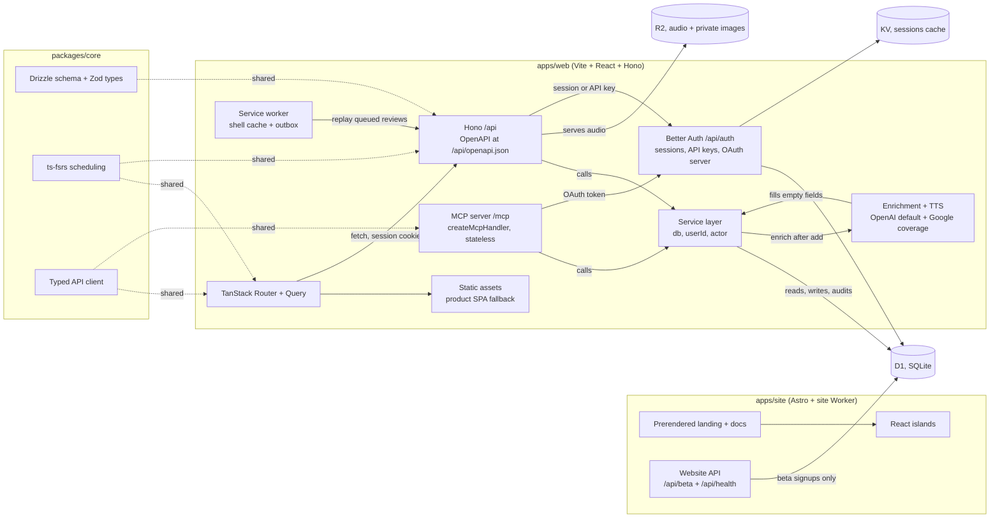

# Technical stack

**Status:** Agreed 5 September 2026, integrations layer decided the same day. Edit in place as decisions change. Vocabulary is in [CONTEXT.md](../CONTEXT.md).

Everything runs on Cloudflare. An Astro site and narrow Worker serve the public website and docs on `lymi.app`. A separate Vite React and Hono Worker serves the product, API, auth and MCP server on `my.lymi.app`. Interactive public sections hydrate as React islands, while the private product remains a client-rendered PWA that behaves like a native app on the phone and like a keyboard-driven web app on the desktop. Shared logic lives in a package a future React Native app can import unchanged.

## Shape



## Decisions

### Clients: prerendered Astro website plus a client-rendered React PWA

The public site at `lymi.app` is statically rendered by Astro. Landing, Join and documentation ship useful HTML and canonical metadata before JavaScript runs; interactive React components hydrate as islands. A narrow Worker serves the static assets, beta signup and a versioned health endpoint. It has no product shell, authentication or PWA behavior.

The signed-in product at `my.lymi.app` is still a client-rendered single-page PWA. It sits behind a login, so a static shell remains the right fit for fast offline starts. TanStack Router gives typed routes and a proper mobile navigation model. TanStack Query, with its IndexedDB persister, is the cache that makes the review screen usable on a train. `/today` is the product home and `/app` redirects there. The product root sends a valid session to Today and a signed-out visitor to sign-in, preserving safe product deep links through authentication.

`vite-plugin-pwa` handles the manifest and Workbox service worker on the product origin only. The app captures Chromium's install event for its in-app button and shows manual instructions on browsers that do not expose one. The shell is precached. Data goes through Query's cache plus a small outbox in IndexedDB (Dexie) for reviews graded offline, replayed when the connection returns. The public deployment neither generates nor serves a product service worker.

Review reminders use standards-based Web Push with VAPID, sent directly by the product Worker. Subscriptions and local reminder times are per device in D1. One UTC Cron Trigger runs every 15 minutes, evaluates each device in its stored IANA timezone, sends only when active cards are due, and atomically records the local date before delivery so retries do not duplicate a reminder. See ADR 0006.

The deployment boundary is accepted in [ADR 0009](adr/0009-public-website-and-product-deploy-separately.md). The permanent origin and authentication contract remains in [ADR 0008](adr/0008-public-website-and-product-use-separate-origins.md), and the implementation rationale is recorded in [Public website and product app architecture](proposals/public-website-and-product-app.md).

### Feels native on the phone

This is a design requirement with a technical checklist:

- `display: standalone`, `theme-color` per theme, splash icons, iOS `apple-mobile-web-app-*` meta.
- `100dvh` layouts, safe-area insets, no body scroll, scroll containers per screen.
- Bottom sheet via Vaul, page transitions via the View Transitions API with a Motion fallback.
- `touch-action: manipulation`, 44 px targets, 16 px inputs, haptics via `navigator.vibrate` where available.
- Keyboard shortcuts and a command palette on desktop; the same routes, a different shell.

The bar is "could be mistaken for native." Every screen is checked on a real iPhone in standalone mode before it ships.

### UI: Tailwind v4 + shadcn/ui on Base UI, tokens from DESIGN.md

Tailwind v4 reads design tokens as CSS variables in OKLCH, which is exactly what DESIGN.md defines. Interactive primitives are shadcn/ui components on Base UI, copied into `apps/web/src/client/components/ui` and restyled with Lymi's tokens rather than shadcn's theme variables; `cn` merges their classes. The hand-built foundations move over one at a time, following [the migration plan](plans/2026-09-13-shadcn-base-ui-design-system.md). Motion for the lantern and transitions. [ADR 0017](adr/0017-interface-primitives-are-shadcn-components-on-base-ui.md).

Alternative considered: hand-built primitives on `<dialog>` and the `popover` attribute with vaul for the drawer. That was the first version. vaul stopped being maintained, and four separate open-and-close implementations disagreed on scroll lock, focus return and which device got which shape.

### Type: self-hosted Onest, sizes in rem

Both apps bundle variable Onest from `@fontsource-variable/onest`: Latin (34 KB), Latin extended (28 KB), Cyrillic (16 KB) and Cyrillic extended (11 KB) woff2 files, each behind a `unicode-range`, so a page downloads only the scripts it renders. The `@font-face` rules declare weights 400–600, the range the interface uses. The Latin file is preloaded, and the product's service worker precaches all four with the shell. No font request leaves the origin.

`--font-sans` puts "Onest Fallback" after Onest: local Arial, or the metric-compatible Liberation Sans, resized so text laid out before the swap already fills Onest's box. The values come from fontTools, run against the shipped Latin file and macOS Arial. `size-adjust` is Onest's average advance width over Arial's, weighted by English letter and space frequency. The ascent, descent and line-gap overrides are Onest's typo metrics (970, −305 and 0 per 1000; `USE_TYPO_METRICS` is set) divided by that adjustment. There are two faces, measured at weight 400 and 500 and split at 450, because Onest widens as it gets heavier and the card term is set at 500. Re-measure when an upgrade changes the font files.

Text sizes are rem, so the reader's default font size scales the type; spacing and radii stay px. Form controls on phones are `1rem`, which is 16 px on iOS, where a smaller size makes Safari zoom on focus.

Alternative considered: the Google Fonts stylesheet with `display=swap`. It cost a connection to two third-party origins before first text, and the service worker could only cache it at runtime. With no metric-matched fallback, the term on the card reflowed when the font arrived.

### Servers: two Cloudflare Workers, with Hono on the product

The public `lymi-site` Worker serves Astro's static output and runs first only for `/api/*`, where it exposes beta signup and health. The product `lymi` Worker routes `/api/*`, `/api/auth/*`, `/mcp`, OAuth discovery and product navigations through Hono before its SPA asset fallback. Product documentation paths redirect to `lymi.app`; unknown product paths can never render public content. Local browser tests run the two Workers on separate loopback origins.

Alternative considered: Cloudflare Pages plus Functions for the website. A Worker with static assets keeps both deployments on the same platform, supplies version metadata and supports the narrow beta action without another service.

### Data: D1 with Drizzle

D1 is SQLite at the edge. Drizzle gives a typed schema shared with the client and generates migrations. One database for now, tenanted by `user_id` from day one so adding users later is a policy change, not a migration. Review history is append-only.

Language lives on the card, not the deck. `cards.language` is nullable; a deck may carry a default as a convenience. Detection fills it in at capture time and a chip lets you correct it. Cards without a language get no audio and no language-specific enrichment, and everything else works the same, so decks can mix languages or hold content that is not vocabulary at all.

Later option: a Durable Object per user holding its own SQLite, which turns sync and offline into a solved problem. Not needed for one user.

### Auth: Better Auth on the Worker

Better Auth runs on Workers, supports D1 natively as of 1.5, and does social login plus sessions, API keys for the public API, and an Expo plugin for the React Native app later. Google is the only sign-in provider at launch. An allowlist of one email keeps the app private until that changes.

Known issue to watch: a reported bug where sessions expire after five minutes with D1 and KV. Test session refresh before relying on it.

Cloudflare Access was considered as an interim and rejected. Better Auth is built first so the API and MCP tokens have one auth system from day one.

Three ways in, one system:

| Caller | Credential | Better Auth piece |
| --- | --- | --- |
| The web app | Session cookie | core |
| curl, scripts, Claude Code | Personal API key, made and revoked in Settings | `apiKey` plugin |
| Claude Desktop, Codex, other MCP clients | OAuth 2.1 access token | `@better-auth/mcp` plugin, which makes this Worker the authorization server |

Claude Desktop and Codex both require OAuth for remote MCP servers, which is why a bearer key alone was not enough. `@better-auth/mcp` (Better Auth 1.7) serves the `.well-known` metadata, the consent page and JWT access tokens. The Worker checks tokens against its own JWKS with no database hit. Cloudflare's `workers-oauth-provider` was the earlier plan and is no longer needed.

Every key and every OAuth grant carries one scope, `read` or `write`. Write allows creating, editing and archiving decks and cards. Nothing an integration holds can grade a review.

### Spaced repetition: ts-fsrs

FSRS in TypeScript, in `packages/core`, used by the client (to schedule offline) and the server (to validate and persist). Grades and intervals are the algorithm's, not invented.

### AI: enrichment plus lazy multilingual speech

**The server does not extract vocabulary from lessons. The MCP client does.** Claude Desktop or Codex already holds the transcript and a model, so it reads the lesson and calls `add_cards`. That keeps the Worker's AI to one job, enrichment: fill the empty fields on a card (meaning, example, pronunciation, language) and leave every field that already has text alone.

Enrichment runs in the background after any add that leaves fields empty, whether the card came from the web quick-capture sheet or from an integration. Typing "sbrigarsi" on the phone and finding the meaning there by the time you open the deck is the point. Each filled field is stored with `source: "ai"` so the UI labels it. Meanings are written in the learner's meaning language, a per-user setting, English by default.

OpenAI remains the text-enrichment vendor and is also the default speech provider for every language on its published TTS support list. Google Cloud Text-to-Speech Chirp 3 HD covers languages outside that list and becomes the runtime fallback for supported locales when OpenAI is not configured or its request fails. The routing layer is provider-neutral, so an R2 hit does not parse credentials or call either vendor.

### MCP: stateless handler in the product Worker

`createMcpHandler` from the Agents SDK at `/mcp`, Streamable HTTP, no Durable Object. `McpAgent` was the earlier plan and is deprecated. Authorization is the Better Auth OAuth server above.

Tools call the same service layer the REST routes call, so MCP cannot bypass product rules and every write lands in the audit log with actor `mcp`. The tool set mirrors the REST API less review grading: list, get, create, update, archive and restore decks; search, get, add, update, archive and restore cards; due counts; settings; insights. An `enrich` tool follows once the enrichment service exists. There is no delete tool because the app has no delete. Claude Desktop does not support elicitation, so the server cannot ask "are you sure". Archive being reversible is the safety. A meaning or example an assistant sends without naming its source is stored as `ai`, so the app never shows an assistant's text as the lesson's.

### Integrations: cards land as cards

A card added through the API or MCP is an ordinary card from the moment it lands. There is no proposals table and no approval step. In its place, an **Activity** view in Settings lists every write made by an integration or the AI, and you can inspect, edit or archive from there. Cards carry a `created_by` actor so Activity can filter without parsing the audit log.

Adds take one card or many. A lesson produces 20 to 40 terms, and one tool call per term is 40 model turns. A **duplicate** is a card whose normalised term and language match an active card anywhere in your decks. A duplicate is skipped, never rejected, and the response names the existing card, so re-running the same call is safe. A card with no language only matches other cards with no language.

### API: a service layer and generated docs

Route logic lives in service functions that take `db`, `userId` and `actor`. Hono routes and MCP tools are thin callers. The OpenAPI document is generated from the Zod schemas in `packages/core` and served at `https://my.lymi.app/api/openapi.json`. The documentation site at `https://lymi.app/docs` renders it without credentials through narrowly scoped CORS; `/api/docs` redirects to the public reference.

### Audio: first play, then R2

Pronunciation audio is generated only when the learner first presses play. Cards without a language never show the control and never call a speech provider. The Worker uses OpenAI for its published languages and Chirp 3 HD only for coverage gaps or when OpenAI is not configured, stores the MP3 in R2, and remembers the object on the card. The cache identity includes the term, locale, provider, model and voice, and changing the term or language detaches stale audio.

### Avatars: Images binding, private R2

A photo is normalised on the Worker by the Cloudflare Images binding, not by a WASM codec: decoding runs outside the Worker's CPU budget and adds nothing to the bundle, and WebP output drops all metadata. The client crops to a square and uploads the crop; the server sniffs the bytes, bounds size and pixels, refuses SVG and animation, and re-encodes whatever arrives. Local development and service tests use the binding's offline mode. Rules are in [the data model](data-model.md#avatars).

### Repo: pnpm workspace

```
lymi/
  apps/site         Public deployable: Astro static site + narrow Worker
    src/pages       Landing, Join, documentation, metadata and public files
    src/worker.ts   Beta signup, health and static asset binding
  apps/web          Product deployable: Vite React PWA client + Hono Worker
    src/client      Routes, components, styles (Tailwind v4 tokens from DESIGN.md)
    src/server      Hono app, Better Auth, API and MCP routes, product asset fallback
    migrations      Drizzle-generated SQL for D1
  packages/core     Drizzle schema, Zod types, ts-fsrs scheduling, ids
  design/           The identity board
  docs/             This file and the brief
```

Each app owns one build artifact and Worker configuration so its custom domain and release lifecycle can change independently. `packages/core` is the stable domain layer both Workers and a future React Native app can import. Brand SVGs and foundational styles are duplicated deliberately for now; a shared design or UI package waits until both clients need a stable common API.

Two workspace details worth knowing. `drizzle-orm` is a dependency of `packages/core` only and is re-exported as `@lymi/core/db`, because better-auth pulls in kysely and pnpm would otherwise build two copies of drizzle with incompatible types. And the Better Auth tables are generated, not hand-written: `pnpm --filter @lymi/web auth:schema` reads `src/server/auth-cli.ts` and writes `packages/core/src/schema/auth.ts`.

### Localization: Lingui catalogs, one app language

The English text in a component is the message. Lingui macros mark it, `lingui extract` writes one `.po` catalog per locale in each app, and `@lingui/vite-plugin` compiles them at build time. The learner's app language is a stored setting that also sets the meaning language; the Worker reads it for push reminders and treats an unset value as English. The public site serves `/uk/` and `/ru/` through Astro's i18n routing with `hreflang` on landing and Join, and the docs stay English. Decisions in [ADR 0012](adr/0012-interface-text-is-english-source-translated-by-lingui.md) and [ADR 0012](adr/0013-app-language-is-one-setting-that-meaning-language-follows.md); order of work in [the localization plan](plans/2026-09-12-localization.md).

Alternatives considered: keyed catalogs (i18next, Paraglide), which make every string change a two-file edit; a hosted translation editor, which is a third service for two locales the maintainer reads herself.

### Tooling

TypeScript strict. Biome for lint and format. Vitest covers packages and Worker behavior. A build-artifact check enforces that the website has no PWA and the product has no public pages. Playwright runs the canonical learning journey and two-origin contract in desktop Chromium and iPhone-sized WebKit against isolated local Cloudflare bindings. GitHub Actions keeps the base gates in one fail-fast quality job and runs required browser E2E beside it, adds Chromium and both Wrangler deployment dry runs for production-affecting pull requests, and runs Chromium plus WebKit on every push to `main` or explicit `/e2e` request. It uploads the public site after the quality job passes for affected pull requests under a stable `pr-<number>` preview alias and verifies the alias against the uploaded Worker version. Separate Cloudflare Workers Builds projects own production deployments from `main`; each health endpoint identifies its active Worker version, and both configurations enable Workers Logs.

Local development accepts email and password sign-in so the app is usable before Google is configured. It is enabled only when `PRODUCT_URL` is a loopback URL.

## Decided

- Sign-in: Google only at launch. Apple can be added when React Native arrives.
- Origins and deployments: `lymi-site` serves the public website and docs on `lymi.app`; `lymi` serves the product, auth, API, MCP and PWA on `my.lymi.app`.
- Auth: Better Auth from the start, no Cloudflare Access interim.
- AI: OpenAI for text enrichment and default speech. Google Chirp 3 HD covers languages outside OpenAI's published list and falls back for supported locales when OpenAI fails.
- Integrations (5 September 2026): MCP clients are Claude Desktop and Codex first, so OAuth from day one via `@better-auth/mcp`. Personal API keys via the `apiKey` plugin. Two scopes, `read` and `write`.
- Cards from integrations are ordinary cards. No proposals table. Activity in Settings is the oversight.
- Duplicate means same normalised term and same language anywhere in the learner's decks. Skipped and reported, never rejected.
- The server enriches, the MCP client extracts. Enrichment is automatic, background, fills only empty fields.
- App language (12 September 2026): one per-user setting, seeded from the browser, drives the interface, push copy and the meaning language. Ukrainian and Russian first. ADR 0013.
- Interface text is English source in the code, translated through Lingui `.po` catalogs, extracted in `pnpm verify`, drafted by the agent on the PR. ADR 0012.
- Integrations never grade reviews.
- No scopes finer than read and write.
- API and MCP (12 September 2026): both expose the whole product surface, less review grading. A service that one has, the other gets in the same pass, so a learner never has to open the app for something an assistant could have done.
- A meaning or example an assistant sends without naming its source is stored as `ai` (12 September 2026). The assistant is a model; the label exists so its text is never shown as the lesson's.

## Sources

- [Full-stack development on Cloudflare Workers](https://blog.cloudflare.com/full-stack-development-on-cloudflare-workers/)
- [Cloudflare Vite plugin](https://developers.cloudflare.com/workers/vite-plugin/)
- [Static assets and SPA fallback](https://developers.cloudflare.com/workers/static-assets/)
- [Better Auth 1.5](https://better-auth.com/blog/1-5)
- [Better Auth + Cloudflare Workers integration guide](https://medium.com/@senioro.valentino/better-auth-cloudflare-workers-the-integration-guide-nobody-wrote-8480331d805f)
- [better-auth-cloudflare](https://github.com/zpg6/better-auth-cloudflare)
